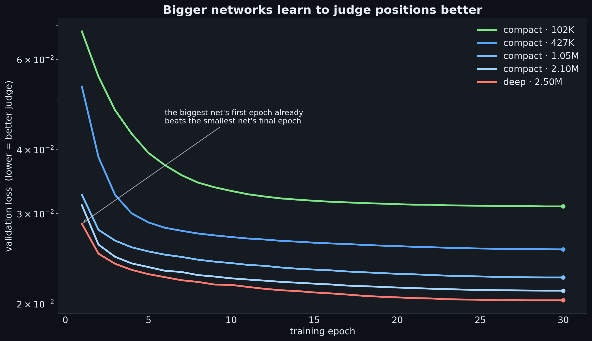
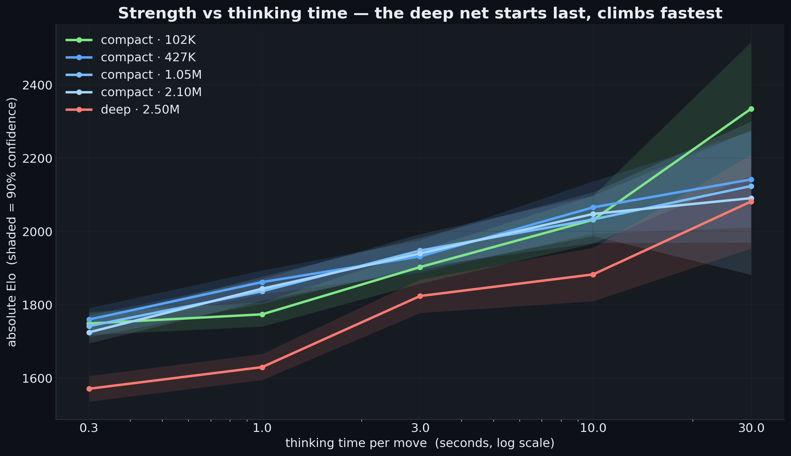
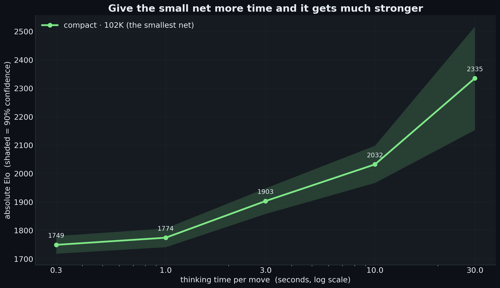
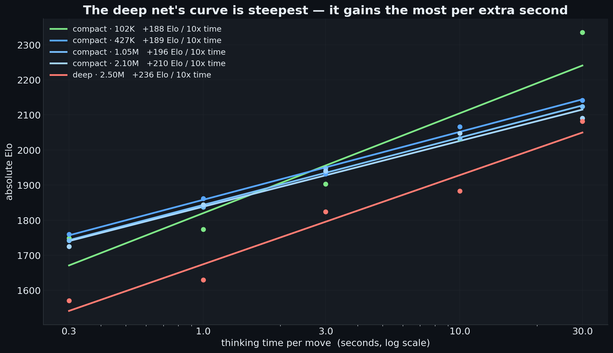
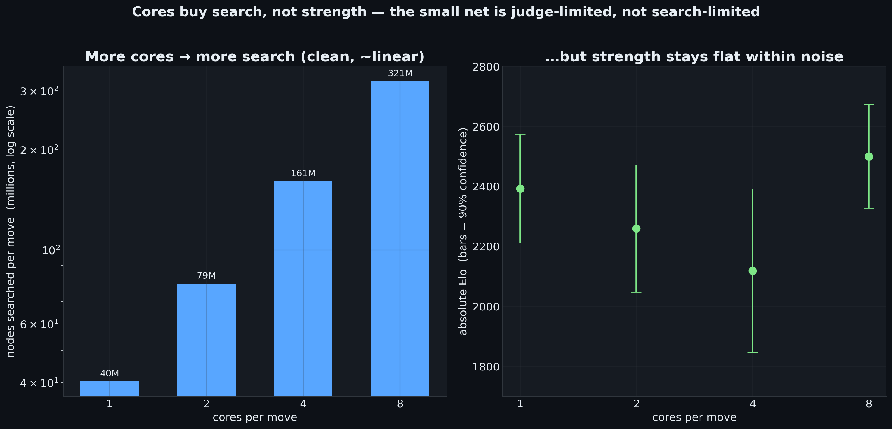

# How big should a chess engine's brain be?

An empirical scaling study. We trained a family of neural-network position
evaluators — the engine's "judge" — from ~100K to ~2.5M parameters, all on the
same ~289M-position dataset with the same objective, then measured how each one
actually **plays** inside our from-scratch C++ search engine across a range of
thinking times and CPU-core counts.

Every number below is **measured, not modelled**: move generation is verified
exact, the C++ integer evaluator matches the Python reference bit-for-bit, and
every Elo comes from real games played by the compiled engine loading the
shipped weights against a calibrated reference opponent set to a ladder of known
skill levels. Elo ranges are 90% confidence intervals computed from the actual
win/draw/loss records.

The five findings, in order:

---

## (a) Bigger networks learn to judge positions better

We trained five networks to the same objective on the same data. Validation
loss (mean-squared error in win-probability space — lower is a better judge of a
position) falls monotonically with size, and the gap is large:

| network | params | best validation loss (30 epochs) |
|---|---:|---:|
| compact · 128×32 | 102,593 | 0.03100 |
| compact · 512×64 | 426,625 | 0.02555 |
| compact · 1024×256 | 1,050,113 | 0.02252 |
| compact · 2048×256 | 2,099,713 | 0.02122 |
| deep · 512×4 blocks | 2,495,489 | **0.02032** |

The effect of capacity is so strong that **the biggest network's *first* epoch
(0.0287) already beats the smallest network's *final* epoch (0.0310).** More
parameters → a strictly better judge of any single position. If raw judgment
were all that mattered, the biggest net would simply be the best engine. It
isn't — which is the whole point of this study.

---

## (b) Strength depends on how much time you give it

We laddered every fully-trained network against the reference opponent across
five time controls — 0.3, 1, 3, 10, and 30 seconds per move — and recorded
absolute Elo with 90% confidence ranges:

| network | params | 0.3s | 1s | 3s | 10s | 30s |
|---|---:|---|---|---|---|---|
| compact · 102K | 102K | 1718–1780 | 1741–1807 | 1858–1948 | 1967–2098 | 2153–2517 |
| compact · 427K | 427K | 1730–1791 | 1829–1894 | 1888–1976 | 1995–2137 | 2011–2273 |
| compact · 1.05M | 1.05M | 1712–1772 | 1803–1870 | 1904–1993 | 1969–2098 | 1970–2277 |
| compact · 2.10M | 2.10M | 1695–1755 | 1811–1877 | 1896–1983 | 1988–2107 | 1882–2300 |
| deep · 2.50M | 2.50M | 1536–1606 | 1595–1666 | 1778–1869 | 1810–1956 | 1954–2210 |

Two things jump out. First, **every network gets dramatically stronger with more
time** — 300–500 Elo from 0.3s to 30s. The clock matters far more than the
architecture. Second, the ranking at the *fast* end is the **reverse** of the
judgment ranking from (a): the small, cheap-to-evaluate networks lead, and the
big, accurate-but-slow deep network is dead last. A better judge does not
translate to a better engine when there is no time to use it.

The confidence ranges are tight at fast controls (~400–500 games each) and wide
at 30s (only ~10–20 games each — a 30s game can run nearly an hour, so we could
play far fewer). Read the 30s column as *suggestive*, the 0.3–10s columns as
*solid*.

---

## (c) The small network climbs steeply as it gets more time

Follow the smallest network (102K parameters) alone. Against the strongest
reference rung its score rises from a hopeless 0.10 at 0.3s/move to a competitive
~0.55 at 30s/move; its absolute Elo climbs **1749 → 1774 → 1903 → 2032 → 2335**.

Why? The small network evaluates a position in 0.77 microseconds — it is so
cheap that extra time converts almost entirely into more search. Each extra
second lets it look at far more positions, and looking further ahead is worth a
lot of Elo. The small net is **search-bound, not judgment-bound**: its limitation
is how far it can see, and time fixes exactly that.

---

## (d) The big network catches up — its curve is steeper

Now the key question: if the big network is the better *judge*, does it ever
overtake the small fast one when given enough time? Fit each network's Elo to a
straight line against log-time — the slope is "Elo gained per 10× thinking time,"
i.e. how fast a network converts time into strength:

| network | params | Elo gained per 10× time |
|---|---:|---:|
| compact · 102K | 102K | +188 (shallowest) |
| compact · 427K | 427K | +189 |
| compact · 1.05M | 1.05M | +196 |
| compact · 2.10M | 2.10M | +210 |
| deep · 2.50M | 2.50M | **+236 (steepest)** |

The slope rises almost perfectly with size. The **deep network starts in the
deepest hole** (it is so slow it can barely search at 0.3s) **but climbs the
fastest** — at 0.3s it trails the field by ~180 Elo; by 30s its confidence range
fully overlaps the others. Its better judgment pays off precisely when there is
time to search deeply enough to express it.

In our measured window the deep network **catches up to, but does not cleanly
pass**, the small nets — the 30s data is too noisy (±150–300 Elo) to declare a
winner there. But the trend is unmistakable and physical: extend the time
control far enough and the better judge should win. The crossover is real as a
direction; nailing the exact point where it passes would need many more games at
long time controls.

---

## (e) More cores buy more search — but not, here, more strength

The final lever: parallel search. Holding the small network fixed at 30s/move,
we gave it more CPU cores per move (1, 2, 4, 8) — each core runs another search
thread exploring the tree at the same time.

| cores | nodes searched per move | absolute Elo (90% CI) |
|---:|---:|---|
| 1 | 40 million | 2392 (2211–2574) |
| 2 | 79 million | 2259 (2047–2472) |
| 4 | 161 million | 2118 (1846–2391) |
| 8 | 321 million | 2500 (2327–2673) |

The mechanism works exactly as designed: **nodes searched per move scale almost
perfectly linearly with cores** — 40M → 79M → 161M → 321M, a clean doubling at
every step. Parallel search is genuinely turning cores into more positions
examined.

But the Elo column tells the honest story: it stays inside one big noisy band
(~2300–2500) where every confidence range overlaps. With ~10 games per point we
cannot distinguish the core counts, and there is no clear upward trend.
**The small network is judgment-bound at 30 seconds, not search-bound:** it has
already searched plenty deep, so pouring in more nodes doesn't move it. There's a
second reason it's hard to win this way — search depth grows only
*logarithmically* in nodes (the tree branches ~6× per ply), so even 8× the nodes
adds only about one extra ply of lookahead. You cannot brute-force your way to a
much deeper search.

---

## Conclusion

The study answers its own question cleanly. **A bigger network is a strictly
better judge of a position (a), but that does not make a better engine on its
own.** Whether judgment or speed wins depends entirely on the clock:

- At **short** time controls, the **small fast network wins** — it is cheap to
  evaluate, so it converts its time into far more search (b, c).
- As the clock grows, the **bigger network's superior judgment catches up**,
  because its evaluation curve is steeper — it gains more Elo per extra second
  (d). Given enough time, the better judge should pass the fast one.
- **Search is the dominant lever**, but you can't get it for free: nodes scale
  linearly with compute (time or cores) while depth grows only logarithmically,
  so once a network is judgment-bound, extra cores stop buying strength (e).

The practical upshot, and the configuration this repository ships by default: a
small, fast network with several search threads is the most robust engine across
ordinary thinking times — fast enough to search deeply, with enough cores to
search widely.
